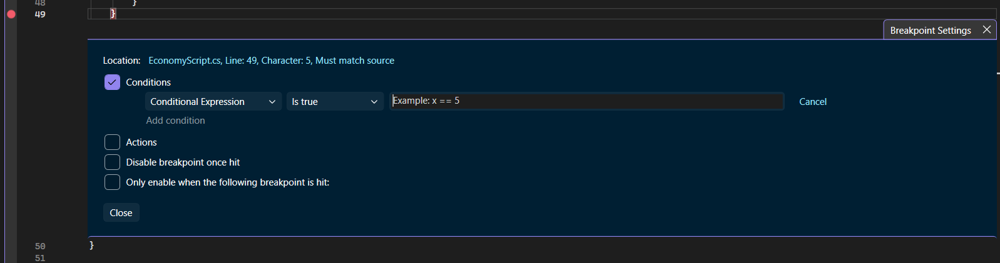
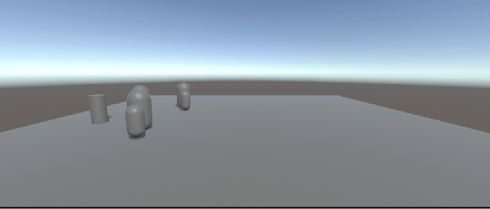
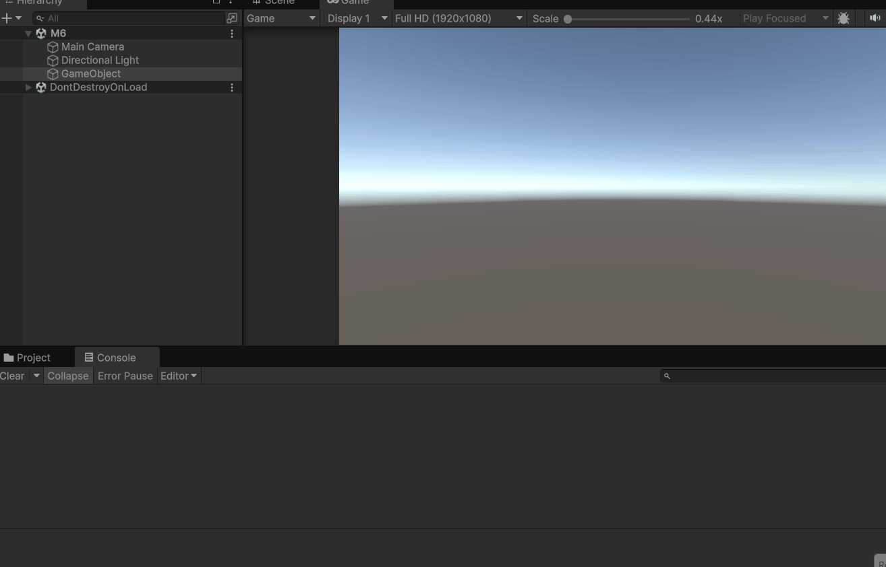
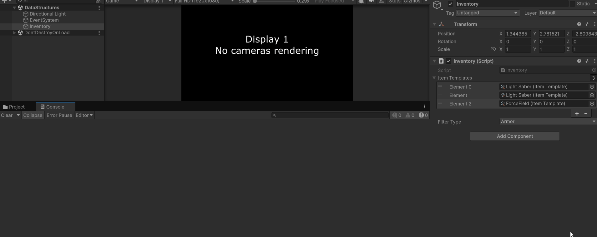
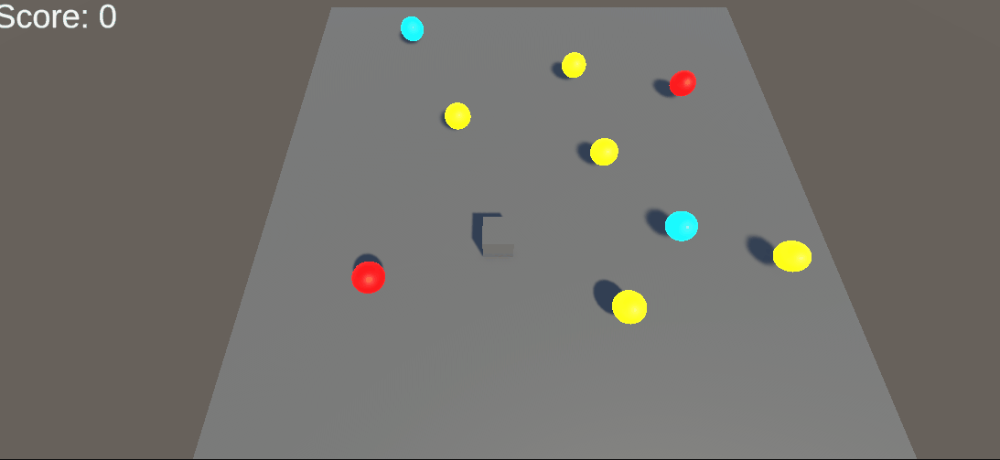

# Opdracht 1
hier heb ik eerst veel ballen spawned met een list die iedere bal heeft en dan iedere seconden ook en bal spawned met initiate


# --------------------------
# Opdracht 2
hier heb ik een object die iedere keer waneer je je muis ik clicked dat hij op een random positie en scale met Instantiate spawned


# --------------------------
# Opdracht 3
hier heb ik als je op Q click dan delete het alle boxes in de list en W dan spawned het 100 boxen en doen ze in een list. en er spawned altijd 1 per seconde


# --------------------------
# Opdracht 4
hier heb ik met action events er voor gezorgd dat je coins kan oppakken en dat je dan die punten krijg die bij die munt hoort


# --------------------------
# Opdracht 5
A : shoot range is 0    ||    target tag has one extra r

B : TowerDefence Opdr

D : 

# --------------------------
# Opdracht 6
hier heb ik de scripts uit elkaar gemaakt zodat het berter beveiligd is als 1 van die scripts breekt


# --------------------------
# Opdracht 7
 X

# --------------------------
# Opdracht 8
hier heb ik met parent classes gewerkt om meerdere scripts met elkaar te linken om 3 enemys te maken



# M6
# --------------------------
# Les 1
hier heb ik een list gemaakt van items en dingen uit die list gehaalt en gestopt



# --------------------------
# Les 2
Mermaid


# --------------------------
# Les 3
hier heb ik met heaps en stacks gewerkt om een inventory te maken (ScriptableObjects, Classes, structs)



# --------------------------
# Les 4
hier heb ik met delegate gewerkt om een function te activeren via een andere script



# --------------------------
# Les 7
hier heb ik met early returns gewerkt om het meer leesbaar te maken

```csharp
public bool IsPlayerReadyToAttack(Player player)
    {
        if (player == null) return false;

        if (!player.IsAlive) return false;

        if (player.AttackCooldown !<= 0) return false;
  
        if (player.Target == null) return false;

        if (!player.Target.IsAlive) return false;


        if (Vector3.Distance(player.transform.position, player.Target.transform.position) !< 5f) return false;

        if (!(player.Mana >= 20 && player.WeaponEquipped) || (player.Health > 30 && player.HasBuff("Strength"))) return false;
        
        if (player.IsStunned || player.IsSlowed) return false;

        return true;
    }

```
 
 ```mermaid
 classDiagram

 class Enemy {
		+int health
		+float speed
		+void Move()
		+void TakeDamage(int damage)
	}

class Goblin {
		+void SpecialGoblinAbility()
	}

Enemy <|-- Goblin

```
