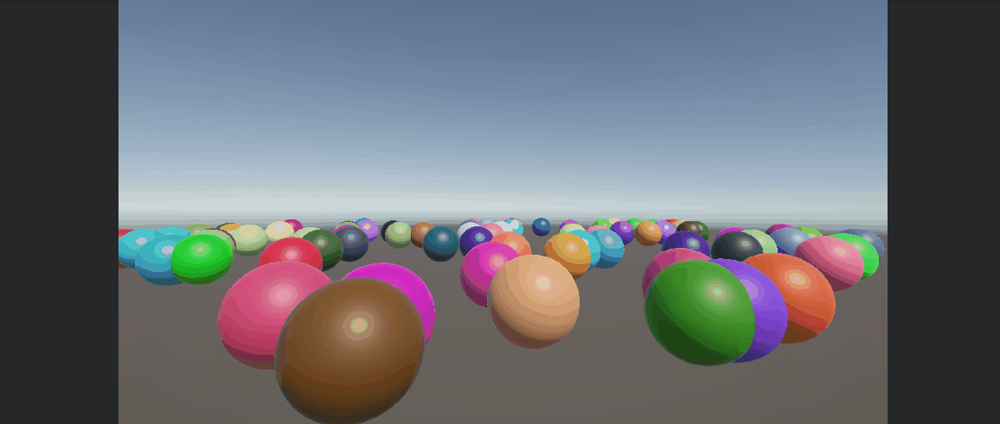
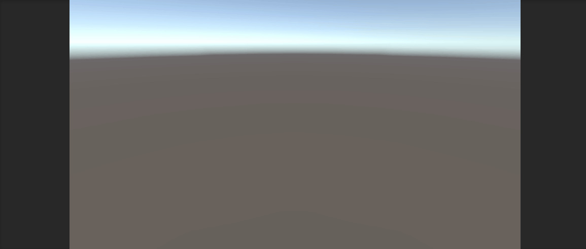
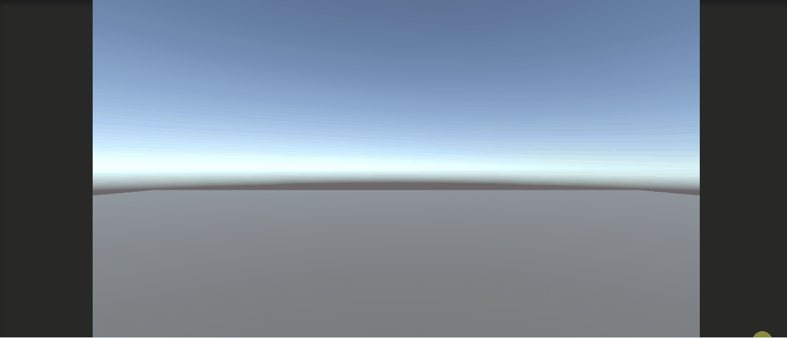

# Opdrach 1
hier heb ik eerst veel ballen spawned met een list die iedere bal heeft en dan iedere seconden ook en bal spawned met initiate

# --------------------------
# Opdrach 2
hier heb ik een object die iedere keer waneer je je muis ik clicked dat hij op een random positie en scale met Instantiate spawned

# --------------------------
# Opdrach 3
hier heb ik als je op Q click dan delete het alle boxes in de list en W dan spawned het 100 boxen en doen ze in een list. en er spawned altijd 1 per seconde

# --------------------------
# Opdrach 3
hier heb ik met action events er voor gezorgd dat je coins kan oppakken en dat je dan die punten krijg die bij die munt hoort

# --------------------------
# Opdrach 4
A : shoot range is 0    ||    target tag has one extra r
B : 
